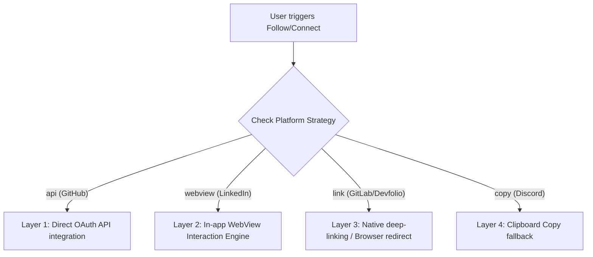

# DevCard Backend

## Follow Engine Architecture

DevCard implements a multi-layered Hybrid Follow Engine designed to connect platform professionals seamlessly while maintaining platform policy compliance.

### Layer 2: WebView Interaction Engine (LinkedIn)

Due to LinkedIn's modern API restrictions preventing programmatic connection requests, direct API follow (Layer 1) is not viable. Instead, the WebView Interaction Engine routes the action through a secure, native WebView:

1. **Routing Strategy**: The backend parses the connection request and returns `{ strategy: 'webview', url }` containing the resolved profile link.
2. **Session Persistence**: The mobile WebView loads the target profile URL using system-level OAuth cookie-sharing (`sharedCookiesEnabled={true}`), ensuring the user remains authenticated.
3. **DOM Introspection**: A lightweight JavaScript snippet is injected to continuously poll for the native LinkedIn 'Connect' button, smooth-scrolls it into view, and highlights it visually to encourage action.
4. **Interactive Send**: Users retain full control over actual connection request submission, adhering completely to platform terms of service.
5. **State Detection**:
   - URL State Polling: The engine inspects URL transitions containing `invite-sent` or similar sub-routes.
   - DOM Observation: The injected Javascript queries for structural indicators of successful invitation (e.g. "Pending" button state or toaster text) and posts a serialized message back to the native layer.
6. **Robust Fallback**: If network or WebView loading times out (>10s), the engine gracefully falls back to native deep links (`linkedin://profile?id={username}`) or launches the default browser with an interactive custom in-app overlay.
7. **Telemetry Logging**: Upon client-side success (detected via state changes or DOM indicators), the mobile app makes a `POST /api/follow/:platform/:targetUsername/log` request to the backend. This writes a record to the `FollowLog` database table for auditing and analytics tracking.
